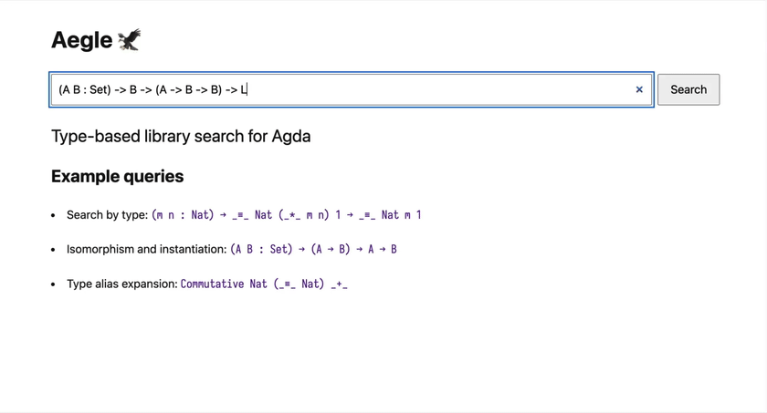

# Aegle 🦅

A prototype type-based library search tool for Agda.



## What It Does

Aegle searches Agda definitions by type, beyond syntactic equality:

- Match up to basic type isomorphisms, so we can find definitions whose types are essentially the same as the query but written in a different shape.

   <details>
     <summary>Supported type isomorphisms</summary>

  ```math
  \begin{align*}
  \Pi x : A. (\Pi y : B. C) &\cong \Pi y : B. (\Pi x : A. C) & \text{if } x \notin \mathrm{FV}(B) \land y \notin \mathrm{FV}(A) && (\Pi\text{-swap}) \\
  A \times B &\cong B \times A &&& (\Sigma\text{-swap}) \\
  \Sigma x : (\Sigma y : A. B). C &\cong \Sigma x: A. (\Sigma y: B[y\mapsto x]. C[x\mapsto (x, y)]) &&& (\Sigma\text{-assoc}) \\
  \Pi x : (\Sigma y : A. B). C &\cong \Pi x: A. (\Pi y: B[y\mapsto x]. C[x\mapsto (x, y)]) &&& (\text{curry}) \\
  \end{align*}
  ```

   </details>

- Match up to generalisation, so we can find definitions that fit the query type after an appropriate instantiation.

- Expand type aliases, so queries do not have to use the same aliases as the definitions they match.

Aegle also synthesises code that makes a matched definition fit the query type.

For query type `(A B : U) → (A → B) → A → B`, Aegle can suggest:

```agda
Function.Base._|>_ : (A : Set) (B : A → Set) (x : A) → ((x : A) → B x) → B x
```

with synthesised code:

```agda
(λ A B x y. _|>_ A (λ z. B) y x) : (A B : Set) → (A → B) → A → B
```

## Usage

### Preparation

1. Start PostgreSQL and keep it running while using Aegle.

   ```sh
   nix run .#service
   ```

2. Set the connection settings in another shell.

   ```sh
   export DATABASE_URL="postgresql://$USER@127.0.0.1:5432/aegle"
   ```

   For the web server:

   ```sh
   export PORT=8080
   ```

3. Generate Agda HTML. Aegle serves HTML files but does not generate them.
   For the bundled agda-stdlib:

   ```sh
   cd vendor/agda-stdlib
   make Everything.agda
   cd doc
   agda --html Everything.agda
   cd ../../..
   ```

### Build

```sh
stack build
```

Nix builds are not supported yet.

### Index libraries

Index Agda libraries listed in a JSON config file.

```sh
stack exec aegle -- index index_config.json
```

### Search from the CLI

```sh
stack exec aegle -- search '(A B : U) → (A → B) → A → B'
# For repeated queries:
stack exec aegle -- interactive
```

### Serve the web UI

Serve the web UI with the generated HTML:

```sh
stack exec aegle -- serve --html-dir vendor/agda-stdlib/doc/html
```

Then open <http://localhost:8080> in your browser.

## Query Syntax

Queries use an Agda-like syntax with restrictions:

- Write all arguments explicitly; implicit arguments are not supported.
- Use prefix names instead of operators.
- Give a domain type for every pi binder.

Example: `Commutative Nat (_≡_ Nat) _+_`

## Reference

Aegle grew out of this paper, though the implementation has since evolved:

- [Satoshi Takimoto et al., "Unification Modulo Isomorphisms between Dependent Types for Type-Based Library Search", TyDe 2025](https://dl.acm.org/doi/10.1145/3759538.3759651)

## Acknowledgements

- Aegle's core calculus is based in part on [elaboration-zoo](https://github.com/AndrasKovacs/elaboration-zoo).
- The translation logic from Agda terms to Aegle terms is based on [agda2hs](https://github.com/agda/agda2hs).

## License

BSD-3-Clause. See [LICENSE](LICENSE).
